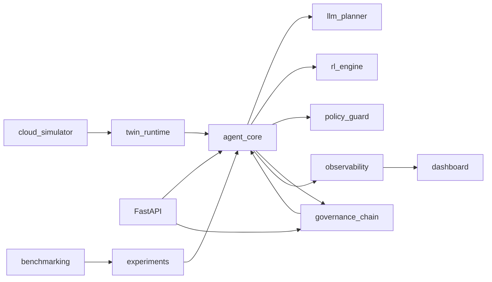
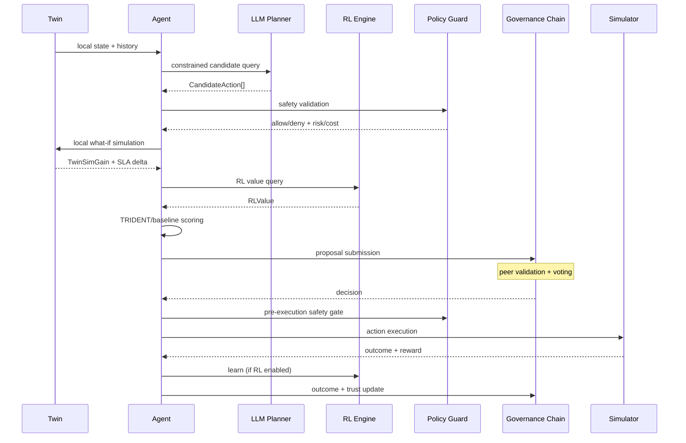
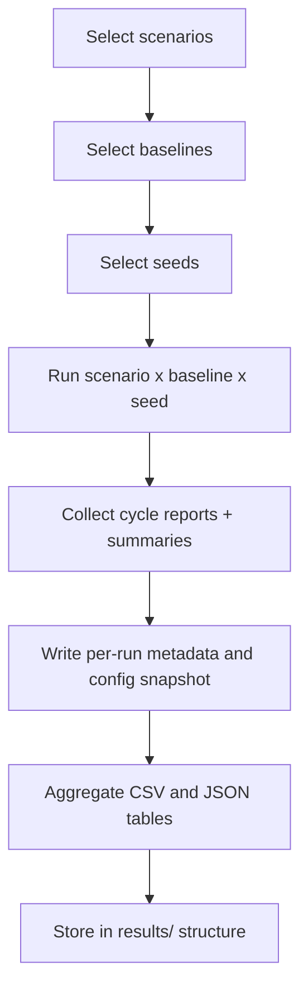

# ATLAS - Agentic Twin Ledger for Autonomous Systems

**Author:** George David Tsitlauri  
**Contact:** gdtsitlauri@gmail.com  
**Website:** gdtsitlauri.dev  
**GitHub:** github.com/gdtsitlauri  
**Year:** 2026

ATLAS is a research-grade, simulation-first prototype for decentralized cloud autonomy.

---
**Research Paper:**
This project is accompanied by a full research paper describing the architecture, methodology, and experimental results of ATLAS. The research and all experiments were conducted in 2026.

You can find the paper in [paper/atlas_paper.tex](paper/atlas_paper.tex).
---

It preserves the core ATLAS identity:
- digital twins per service/node
- intelligent local agents
- constrained LLM planning
- reinforcement learning adaptation
- TRIDENT composite scoring and governance
- lightweight permissioned ledger for trusted coordination
- no central controller
- safety and observability as first-class requirements

## 1. Project Overview

ATLAS models a distributed cloud environment where each twin-agent pair reasons locally, proposes actions, reaches peer consensus, and records decisions on a permissioned append-only ledger.

The prototype is optimized for local reproducible experiments on a Windows 11 laptop.

## 2. Research Motivation

Modern distributed systems need autonomous control that remains safe, auditable, and decentralized.
ATLAS explores this by combining:
- local simulation-based prediction
- LLM-based constrained planning
- RL-guided long-horizon value estimation
- trust-aware permissioned governance

## 3. Architecture Summary



## 4. Core Components

- cloud_simulator: services, nodes, workload pressure, faults, recovery, SLA behavior
- twin_runtime: local state mirror, local history, what-if simulation
- agent_core: proposal generation, peer validation, action interface
- llm_planner: mock/ollama/openai-compatible planning with strict schema validation
- rl_engine: lightweight tabular Q-learning
- policy_guard: hard safety constraints and rejection logic
- governance_chain: permissioned SQLite-backed append-only block ledger
- observability: metrics, events, traces, trust, RL stats, metadata snapshots
- api: FastAPI runtime control-plane
- cloud_provider: optional AWS Lambda, SageMaker, and Azure Functions integration helpers
- dashboard: Streamlit visibility layer
- experiments and benchmarking: repeatable scenario and baseline comparison runner

## 5. TRIDENT Algorithm

TRIDENT (Trust-weighted Reinforcement-Informed Decentralized Twin Governance):

Score(a) = alpha * TwinSimGain
         + beta * RLValue
         + gamma * SLAImprovement
         - lambda * Risk
         - mu * Cost
         + nu * Trust

Implemented in:
- src/atlas/agent_core/trident.py
- src/atlas/agent_core/agent.py

## 6. Baseline Modes

ATLAS supports comparable baseline modes in a shared execution pipeline:
- random_policy
- rule_based_policy
- trident_no_rl
- trident_no_trust
- full_trident

Where configured:
- config/default.toml -> [system].baseline_mode
- CLI flags
- experiment and benchmark scripts

## 7. Component Interaction Diagram



## 8. Benchmark Workflow Diagram



## 9. Repository Structure

```text
atlas/
  config/
    default.toml
  src/atlas/
    cloud_simulator/
    twin_runtime/
    agent_core/
    llm_planner/
    rl_engine/
    governance_chain/
    policy_guard/
    observability/
    cloud_provider/
    api/
    baselines.py
    experiment_runner.py
    benchmarking.py
    orchestrator.py
    cli.py
  dashboard/
    app.py
  experiments/
    run_scenario.py
    run_benchmark.py
    scenarios/*.json
  results/
    benchmark_runs/
    summaries/
    sample_reports/
  scripts/
    *.ps1
    *.sh
  docs/
    architecture.md
    api.md
```

## 10. Setup - Windows 11

```powershell
./scripts/setup.ps1
```

## 11. Setup - WSL2 / Linux

```bash
bash scripts/setup.sh
```

## 12. Docker Compose

```bash
docker compose up --build
```

- API: http://localhost:8000
- Dashboard: http://localhost:8501

## 13. Quickstart

Primary local run command:

```powershell
./scripts/run_local.ps1 -Steps 20 -BaselineMode full_trident -Seed 42 -Deterministic $true -LogsDir logs/latest
```

Primary benchmark command:

```powershell
./scripts/run_benchmark.ps1 -Steps 20 -Baselines "random_policy,rule_based_policy,trident_no_rl,trident_no_trust,full_trident" -Seeds "42" -ResultsRoot results
```

Primary test command:

```powershell
./scripts/run_tests.ps1
```

Primary dashboard command:

```powershell
./scripts/run_dashboard.ps1 -LogsDir logs/latest
```

## 14. API Quick Commands

```powershell
./scripts/run_api.ps1 -BaselineMode full_trident -Seed 42 -Deterministic $true -LogsDir logs/latest
```

Health and governance audit:
- GET /health
- GET /ready
- GET /governance/audit

## 15. Running Experiments

Single scenario run:

```powershell
./scripts/run_experiment.ps1 -Scenario overload -Steps 20 -BaselineMode full_trident -Seed 42 -LogsDir logs/overload
```

Direct CLI run with a custom scenario file:

```powershell
python -m atlas.cli scenario --scenario-file experiments/scenarios/node_failure.json --steps 20 --baseline-mode trident_no_trust --seed 99 --deterministic --logs-dir logs/node_failure_no_trust
```

## 16. Running Benchmarks

Full matrix (all baselines, all scenarios, one seed):

```powershell
python experiments/run_benchmark.py --steps 20 --scenarios overload,node_failure,latency_spike,conflicting_proposals,resource_scarcity --baselines random_policy,rule_based_policy,trident_no_rl,trident_no_trust,full_trident --seeds 42 --results-root results
```

Multi-seed benchmark:

```powershell
python experiments/run_benchmark.py --steps 20 --seeds 7,42,99 --results-root results
```

## 17. Output and Result Files

Per run (logs directory):
- metrics.csv
- events.jsonl
- decision_traces.jsonl
- trust_scores.jsonl
- rl_stats.jsonl
- state_latest.json
- run_metadata.json
- config_snapshot.json
- cycle_reports.json
- summary.json
- atlas_ledger.db

Benchmark outputs:
- results/benchmark_runs/<run_id>/<baseline>/<scenario>/seed_<seed>/...
- results/summaries/<run_id>.csv
- results/summaries/<run_id>.json
- results/summaries/<run_id>_metadata.json
- results/sample_reports/<run_id>_sample.json

## 18. Evaluation Metrics Collected

- decision latency
- consensus latency
- SLA violations
- recovery time
- resource utilization
- cost proxy
- trust score evolution
- RL reward trends
- action success/failure rate
- governance overhead

## 19. Safety and Validation

Safety constraints are enforced in policy_guard and checked:
- during proposal scoring
- during peer validation
- immediately before execution (pre-execution policy gate)

Invalid/unsafe actions are rejected and logged.

LLM candidate outputs are strictly schema-validated.

## 20. Reproducibility Features

- configurable seed and deterministic mode
- global seed setup for supported libraries
- run metadata snapshots
- per-run config snapshots
- pinned dependency versions
- scenario definitions in versioned JSON

## 21. Dashboard Usage

The Streamlit dashboard can load any run directory.

Use the sidebar Logs directory field to inspect:
- latest run
- a scenario run folder
- a benchmark run folder for a specific baseline/scenario/seed

## 22. Testing and Quality

```powershell
./scripts/run_lint.ps1
./scripts/run_tests.ps1
```

CI workflow included in:
- .github/workflows/ci.yml

## 23. Troubleshooting

- ModuleNotFoundError: atlas
  - Use the setup script and run from project root.
  - Alternative quick run: set PYTHONPATH=src.

- API starts but no metrics
  - Execute at least one cycle or scenario run first.

- Empty benchmark outputs
  - Verify scenario names and baseline list values.

- Slow runs on laptop
  - Keep default node counts (3 twins, 3 governance nodes).
  - Use mock planner mode.
  - Reduce steps or seed count in benchmark runs.

## 24. Limitations

- simulation-first design, not production infrastructure
- lightweight governance semantics, not full Byzantine protocol stack
- LLM planner integrations are optional and can fallback to mock mode
- RL implementation is tabular and intentionally compact

## 25. Future Work

- richer trust models and adversarial behavior simulations
- distributed message-delay and partition simulation
- deeper RL experiments under controlled resource budgets
- configurable governance protocol variants
- broader statistical benchmarking across more seeds and workloads

## Citation

```bibtex
@misc{tsitlauri2026atlas,
  author = {George David Tsitlauri},
  title  = {ATLAS: Agentic Twin Ledger for Autonomous Systems},
  year   = {2026},
  institution = {University of Thessaly},
  email  = {gdtsitlauri@gmail.com}
}
```
