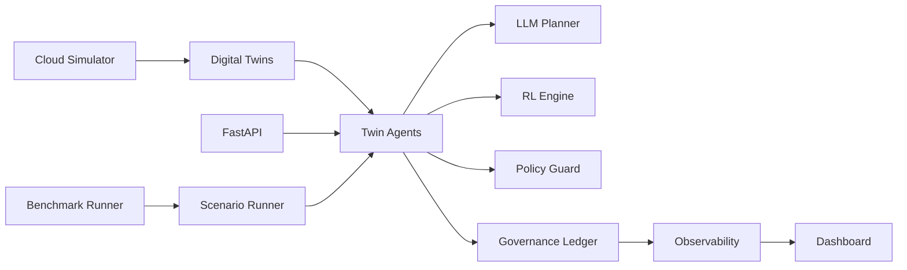
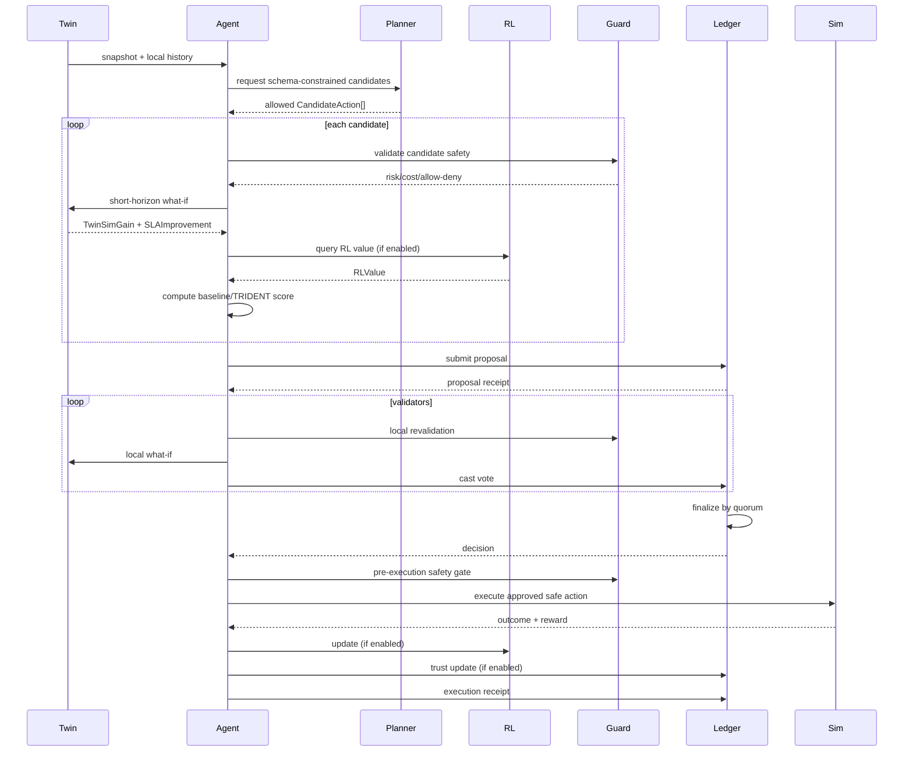

# ATLAS Architecture

## Design Intent

ATLAS is a decentralized cloud autonomy prototype that keeps TRIDENT as the core decision policy.
The architecture favors clarity, auditability, and reproducible experiments over production-scale infrastructure complexity.

## High-Level Topology

## TRIDENT-Centric Decision Loop

## Baseline Modes

ATLAS supports policy baselines within the same execution pipeline:
- random_policy
- rule_based_policy
- trident_no_rl
- trident_no_trust
- full_trident

Shared infrastructure is preserved across modes:
- same simulator
- same governance path
- same safety guard
- same observability outputs

This makes cross-mode results directly comparable.

## Governance and Trust

Governance chain:
- permissioned members only
- append-only block table with hash chaining
- proposal, vote, decision, execution, trust entries
- consistency audit checks for linkage and chain integrity

Trust updates:
- enabled for full_trident and trident_no_rl
- disabled for trust-disabled baselines

## Reproducibility and Outputs

Per run, ATLAS records:
- run_metadata.json
- config_snapshot.json
- metrics.csv
- events.jsonl
- decision_traces.jsonl
- trust_scores.jsonl
- rl_stats.jsonl
- state_latest.json
- atlas_ledger.db

Benchmark suite aggregates outputs to results/summaries in CSV/JSON.

## Safety Guarantees in Runtime

Action execution cannot bypass safety checks.
Safety validation occurs at three levels:
- candidate generation stage
- peer voting validation stage
- pre-execution runtime gate

Rejected actions are logged with explicit reasons.
